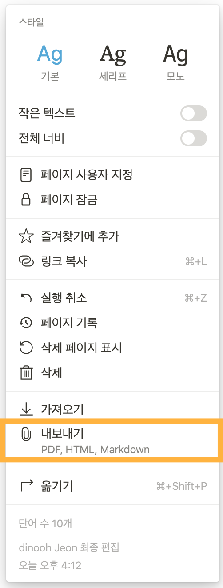
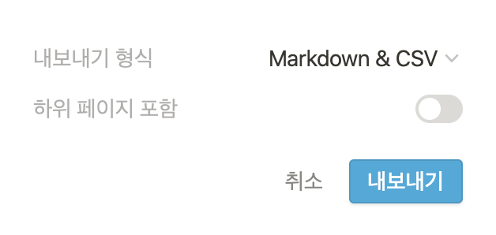
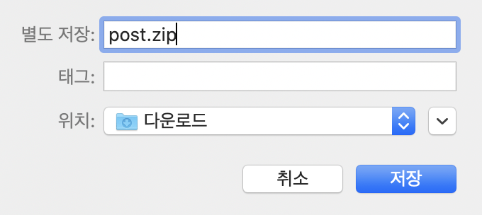
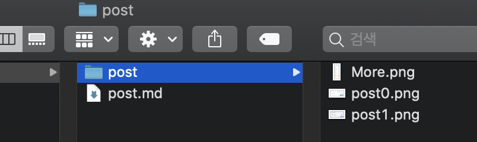
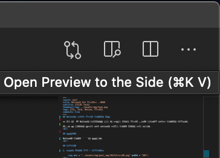
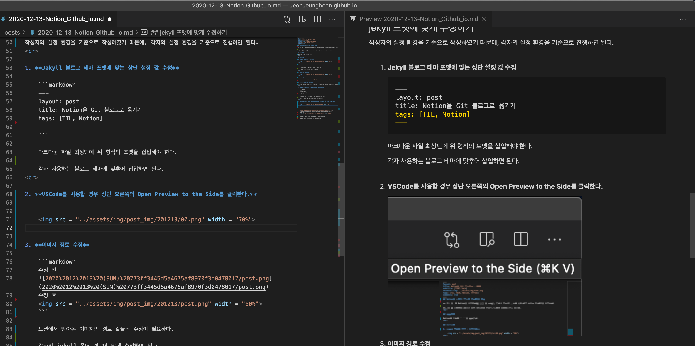

## Notion을 활용해 블로그 포스팅을 하자  

약 2달 전부터 Notion을 사용하다가 얼마 전 시작한 깃허브 블로그 때문에 마크다운 언어로 포스팅을 해보았다.  

그러던 중 불편함을 느끼게 되어 notion을 활용한 포스팅 방법을 찾게 되었다.  
<br>

## 작성하기

Notion에 포스팅 할 글을 작성한다.
<br>

## 내보내기

1. **상단 우측의 메뉴 - 내보내기**

      
<br>

2. **설정**

    

    - 내보내기 형식: Markdown & CSV 로 설정한다.
    
    - 하위 페이지: 토글을 ON으로 설정한다.  
<br>

3. **파일의 저장 위치**

     
<br>

4. **압축 풀기**

    
  
<br>

## jekyll 포맷에 맞게 수정하기

작성자의 설정 환경을 기준으로 작성하였기 때문에, 각자의 설정 환경을 기준으로 진행하면 된다.  
<br>

1. **Jekyll 블로그 테마 포맷에 맞는 상단 설정 값 수정**

    ```markdown
    ---
    layout: post
    title: Notion을 Git 블로그로 옮기기
    tags: [TIL, Notion]
    ---
    ```

    마크다운 파일 최상단에 위 형식의 포맷을 삽입해야 한다.

    각자 사용하는 블로그 테마에 맞추어 삽입하면 된다.  
<br>

2. **VSCode를 사용할 경우 상단 오른쪽의 Open Preview to the Side를 클릭한다.**

      
    <br>

    해당 옵션을 설정하면 마크다운 언어가 실시간으로 적용된 화면을 보면서 수정할 수 있다.  
    <br>

      
<br>
    

3. **이미지 경로 수정**

    다음과 같이 수정한다.  

    ```markdown
    수정 전 예시
    %20773ff3445d5a4675af8970f3d0478017/post.png)
    수정 후 예시
    
    ```

    노션에서 받아온 이미지의 경로 값들은 수정이 필요하다.

    각자의 jekyll 폴더 경로에 맞게 수정하면 된다.