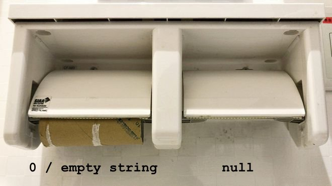

### TIL 03
## 파일디스크립터 (Fd)

- 음수가 아닌 양수인 정수이다. (0, 1, 2...)

- 보통 C언어에서 int 값을 가진다.

- 음수는 **값이 없을 때** 혹은, **에러**를 나타낸다.

    |<center>Integer value|<center>Name</center>|<center><unistd.h><br>symbolic constant</center>|<center><stdio.h><br>file stream</center>|
    |-|-|-|-|
    |0|Standard input|STDIN_FILENO|stdin|
    |1|Standard output|STDOUT_FILENO|stdout|
    |2|Standard error|STDERR_FILENO|stderr|

## Read 함수

```c
#include <unistd.h>
ssize_t read(int fd, void *buf, size_t nbyte);
```
- read 함수는 오픈된 파일로부터 nbyte 씩 읽는다.

## 한 눈에 보는 "" 과 (null)의 차이

  

- 왼쪽: **""**

- 오른쪽: **(null)**