## Docker 튜토리얼 따라 해본 기록

[https://www.docker.com/101-tutorial](https://www.docker.com/101-tutorial)  
<br>

## 튜토리얼 컨테이너 생성 및 실행

호스트 터미널에서 다음과 같은 명령어를 날린다.  

```bash
docker run -d -p 80:80 docker/getting-started
```  

**run**

- 컨테이너를 생성하고 시작하는 명령어

- create 라는 생성 명령어 그리고 start 라는 시작 명령어를 한번에 해결한다.  
<br>

**-d**

- 컨테이너를 백그라운드(detached 모드)에서 실행하며, 실행 결과로 컨테이너 ID 만을 출력한다.  
<br>

**-p 80:80**

- 호스트 포트 80과 컨테이너 포트 80을 매핑한다.  
<br>

**docker/getting-started**

- 사용할 이미지

위 명령어를 사용하면 튜토리얼 전용 컨테이너가 생성되고 실행된다.

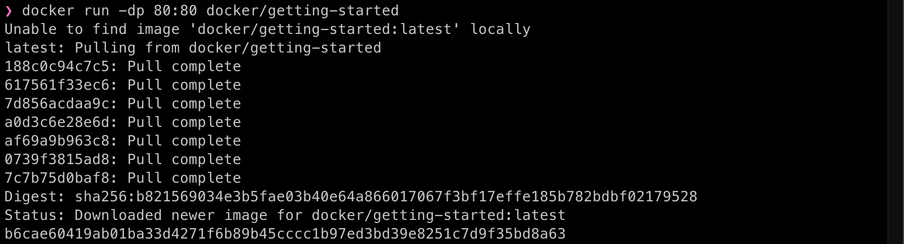  
<br><br>

컨테이너가 생성된 모습

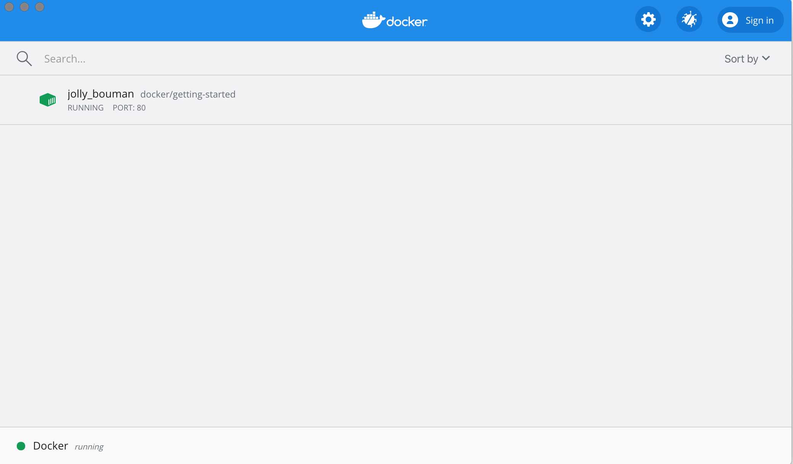
<br><br>

## To do list managing 애플리케이션을 빌드 후 실행하기

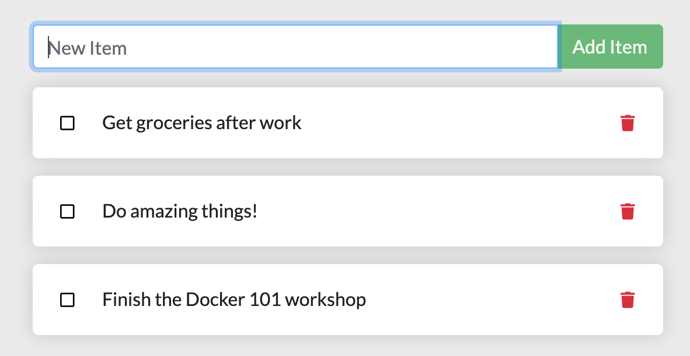  

**1. 튜토리얼에 필요한 압축 파일을 다운 받은 후, 압축 해제를 한다.**

**2. 압축 해제하여 생긴 app 폴더에 Dockerfile 파일을 만든 후, 아래와 같이 작성한다**

    ```bash
    FROM node:12-alpine
    WORKDIR /app
    COPY . .
    RUN yarn install --production
    CMD ["node", "src/index.js"]
    ```  

FROM

- 유효한 Dockerfile은 FROM 명령으로 시작해야 한다.
    
- 베이스 이미지를 지정한다.  
<br>

WORKDIR

- 명령어를 적용할 폴더 위치  
<br>

COPY

- 호스트 OS의 파일 또는 디렉토리를 컨테이너 안의 경로로 복사한다.  
<br>

RUN

- 새 이미지 레이어를 만들어 내어, 명령을 실행하고 결과를 커밋한다.
    
- 백슬래시를 사용할 경우 다음 줄에 RUN 명령을 추가할 수 있다.
    
- 항상 apt-get update 와 apt-get install 은 같은 RUN 실행줄에서 동시에 실행해 캐싱 문제를 방지한다. (같은 결과를 가져오더라도 RUN 을 여러 줄로 작성하면 image layer가 여러개 생성되고, RUN 을 한 줄로 작성하면 image layer 가 하나 생성된다.)  
<br>

CMD

- 생성된 컨테이너를 실행할 명령어를 지정한다
    
- 도커 파일에 CMD가 두 개 이상 있는 경우 마지막 CMD만 유효하다.  
<br>

yarn: app 폴더 내부에 있는 파일이다.  
<br>

**3. 호스트 터미널에서 다음과 같은 명령어를 날린다.**

    ```bash
    docker build -t getting-started .
    ```

- Dockerfile 을 이용하여 새로운 컨테이너 이미지를 빌드하는 명령어  
<br>

-t

- 빌드할 이미지의 이름 지정  
<br>

getting-started

- 생성할 이미지명  
<br>

' . '

- Dockerfile 이 현재 폴더에 위치해 있다고 알려주는 명령어  
<br>

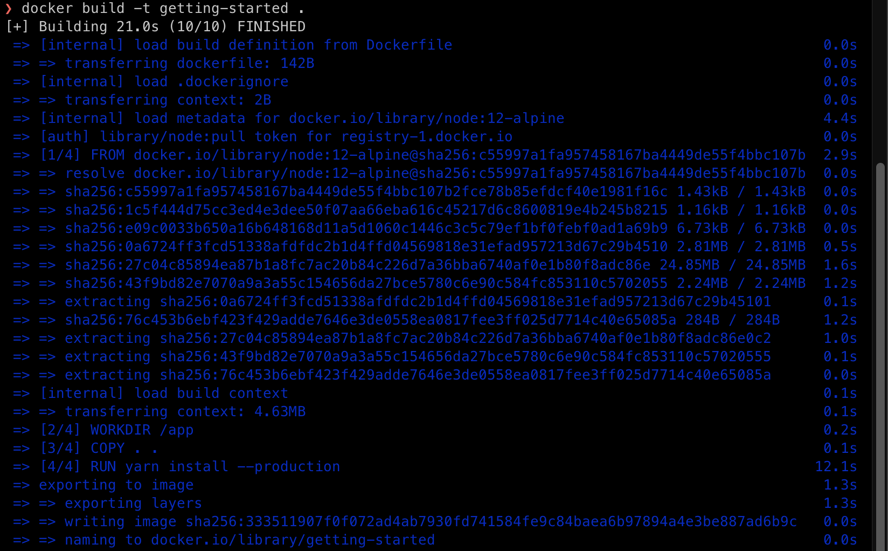  
<br><br>

4. **다음 명령어를 날려 애플리케이션을 실행한다.**

    ```bash
    docker run -dp 3000:3000 getting-started
    ```

    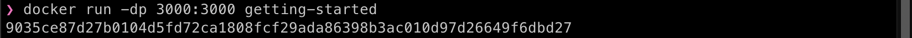  
<br>

5. **[http://localhost:3000](http://localhost:3000/) 링크에서 애플리케이션이 구동되는 걸 확인할 수 있다.**

    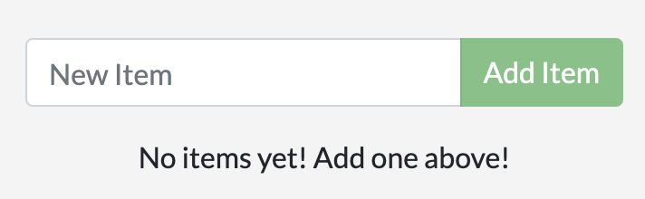  

    애플리케이션이 실행되고 있는 모습

    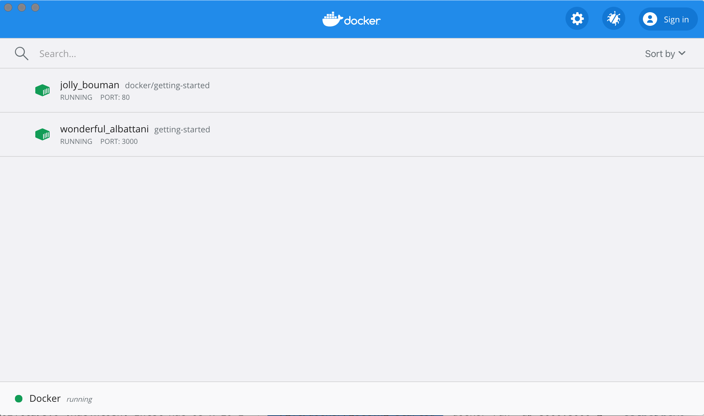  
<br>

## 컨테이너 제거하기

- 업데이트가 필요한 파일을 수정한 후, 다음 명령어를 통해 업데이트한다.

    ```bash
    docker build -t getting-started .
    ```  
<br>

- 업데이트 된 새로운 컨테이너를 실행시킨다.

    ```bash
    docker run -dp 3000:3000 getting-started
    ```  
<br>

- 그러나 이미 실행되고 있는 컨테이너 때문에, 오류가 발생한다.
업데이트가 적용된 컨테이너를 실행하기 위해 실행되고 있는 컨테이너를 제거해야 한다.

    ```bash
    docker: Error response from daemon: driver failed programming external connectivity on endpoint laughing_burnell 
    (bb242b2ca4d67eba76e79474fb36bb5125708ebdabd7f45c8eaf16caaabde9dd): Bind for 0.0.0.0:3000 failed: port is already allocated.
    ```  

**1. 컨테이너를 제거하기 위해서는 우선 컨테이너의 실행을 멈추어야 한다.**

**2. 컨테이너를 제거하는 방법은 세 가지가 있다. 취향에 맞는 것을 사용하면 된다.**

1. CLI를 사용하여 컨테이너 제거하기

    1. 다음 명령어를 사용해 컨테이너의 아이디를 받는다.

        ```bash
        docker ps
        ```  
    <br>

    2. 다음 명령어와 컨테어너의 아이디를 사용하여 컨테이너를 멈춘다.

        ```bash
        docker stop <the-container-id>
        ```  
    <br>

    3. 다음 명령어와 컨테이너의 아이디를 사용하여 멈춘 컨테이너를 삭제한다.

        ```bash
        docker rm <the-container-id>
        ```  
    <br>

2. Docker Dashboard를 사용하여 컨테이너 제거하기

    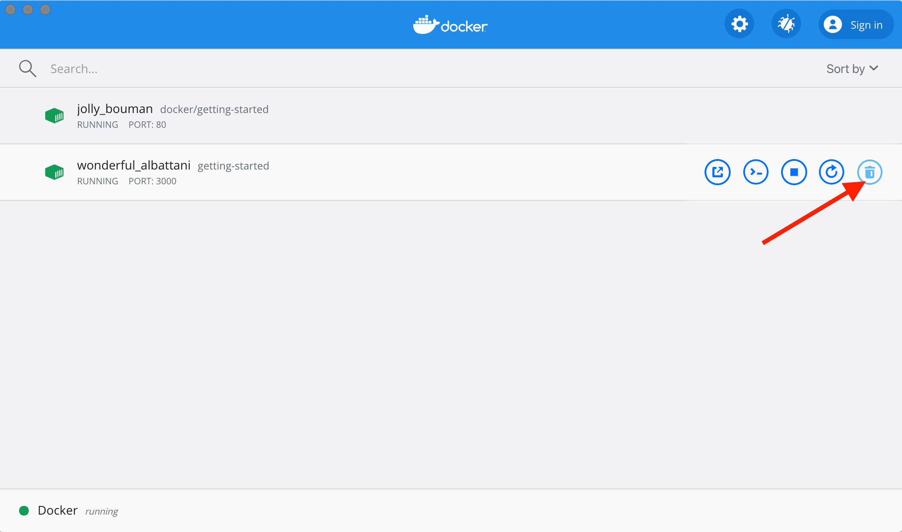    
<br>

3. force flag를 사용하여 컨테이너 제거하기


        ```bash
        docker rm -f <the-container-id>
        ```  
<br>

## Docker Hub 에 이미지 올리기

1. Docker Hub 에 저장소 만들기

    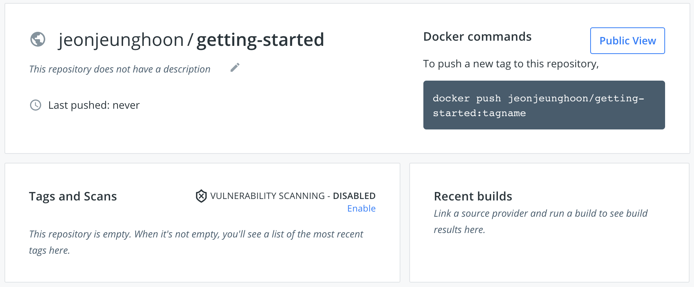  
<br>

2. 다음 명령어를 사용하여, 이미지를 push 한다.

    ```bash
    docker push docker/getting-started
    ```  
<br>

3. 그러나 docker/getting-started 이미지를 찾지 못하여 오류가 발생한다.

    ```bash
    The push refers to repository [docker.io/docker/getting-started]
    An image does not exist locally with the tag: docker/getting-started
    ```  
<br>

4. 이 문제를 해결하기 위해 기존에 만든 이미지에 다른 이름을 태그해야 한다.

5. 다음 명령어를 사용하여 docker hub에 로그인하여 이미지의 이름을 수정한다.  

**YOUR-USER-NAME은 본인의 도커 허브 아이디다.**

```bash
docker login -u YOUR-USER-NAME
```

docker tag 명령어를 사용하여 getting-started 이미지에 새로운 이름을 부여한다.  

```bash
docker tag getting-started YOUR-USER-NAME/getting-started
```  
<br>

6. 다음 명령어를 사용하여 이미지를 push 한다.

    ```bash
    docker push YOUR-USER-NAME/getting-started
    ```

    도커허브에서 이미지를 복사하는 경우 이미지 이름에 태그를 추가하지 않았으므로 태그 이름 부분을 삭제할 수 있다. 태그를 지정하지 않으면 도커는 latest 라는 태그를 사용한다.  

    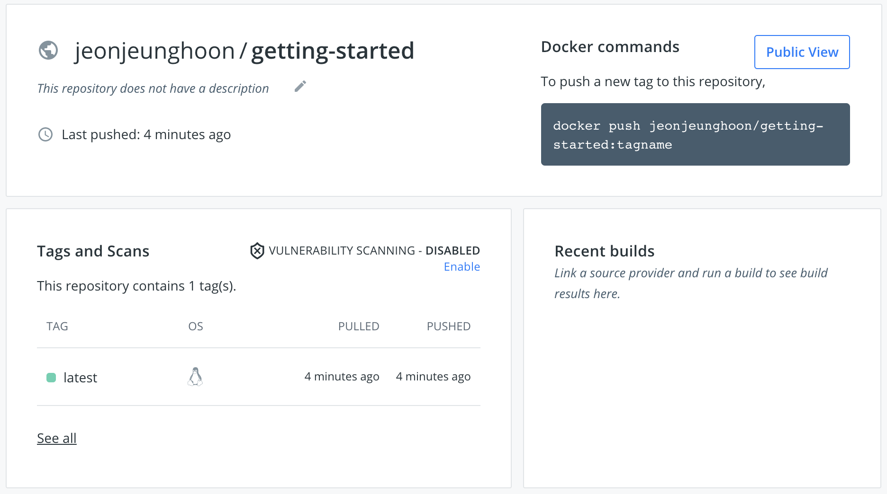  
<br>

## 마운트

### 컨테이너 Filesystem

- 컨테이너는 다양한 레이어의 이미지를 사용하여 실행되는 형식의 파일 시스템이다.

- 각 컨테이너에는 파일을 생성/업데이트/제거할 수 있는 자체 "스크레치 공간" 이 있다.

- 그래서 컨테이너에서 데이터를 변경 하였을 때 동일한 이미지를 사용하는 경우라도, 다른 컨테이너에서는 변경 사항이 적용되지 않는다.  
<br>

### 컨테이너 볼륨

- 볼륨은 특정한 컨테이너의 경로를 호스트와 연결해주는 기능을 제공한다.

- 컨테이너의 디렉토리가 마운트된 경우 디렉토리의 변경 내용이 호스트에도 적용된다.

- 컨테이너 재실행 시 동일한 디렉토리를 마운트하면 동일한 파일이 표시된다.

- 볼륨에는 크게 두 가지 유형이 있다.  
<br>

### Todo Data 유지하기

- 볼륨을 생성하여 데이터를 저장하는 디렉토리에 마운트한다.

- named-볼륨을 사용할 것이다.

- 볼륨을 사용할 때 마다 Docker는 올바른 데이터가 제공되었는지 확인한다.

    1. 다음 명령어를 사용하여 볼륨을 생성한다.

        ```bash
        docker volume create todo-db
        ```

    2. 볼륨 업데이트를 적용하기 위해 실행 중이던 컨테이너를 종료한다.

    3. 다음 명령어를 사용하여 볼륨이 마운트 된 todo app 컨테이너를 실행한다.

        ```bash
        docker run -dp 3000:3000 -v todo-db:/etc/todos getting-started
        ```

    4. todo에 데이터를 저장한 후 컨테이너를 종료한다. 그리고 컨테이너를 재실행하였을 때 데이터가 남아 있는지 확인한다.  
<br>

### 볼륨 파일 탐색하기

다음 명령어를 사용하여 데이터가 저장되는 볼륨을 살펴본다.

```bash
docker volume inspect todo-db
```  
<br>

## 바인드 마운트

- 호스트의 마운트 지점을 정확히 제어할 수 있다.

- 종종 컨테이너에 추가 데이터를 더할 때 사용된다.

- 코드 변경사항을 바로 적용하고, 변경사항을 바로 확인할 수 있다.  
<br>

### 개발 워크플로우를 지원하기 위한 컨테이너 실행 계획

- 컨테이너에 소스 코드를 마운트한다.

- 의존 파일들을 dev에 위치시킨다.

- 파일 시스템 변화를 감지할 노드 데몬을 실행한다.  
<br>

### 실행 사항

**1. 실행 전에 getting-started 컨테이너는 다 종료해야 한다.**

**2. app/ 폴더 내부에서 다음 명령어를 사용한다.**

```bash
docker run -dp 3000:3000 \
    -w /app -v "$(pwd):/app" \
    node:12-alpine \
    sh -c "yarn install && yarn run dev"
```

-w /app

- 명령실행하는 폴더위치를 설정하는 플래그다.  
<br>

-v "$(pwd):/app"

- 컨테이너 호스트에서 /app 폴더에 현재 디렉토리를 바인드 마운트한다.  
<br>

node:12-alpine

- 현재 애플리케이션의 베이스 이미지로서, 사용할 이미지이다.  
<br>

sh -c "yarn install && yarn run dev"

- sh (알파인에는 bash가 없다) 를 사용하여 쉘을 시작하고, yarn 설치를 실행하여 모든 의존파일을 설치한 다음, yarn run dev를 실행한다.

- package.json에서 dev 스크립트가 노드 데몬을 시작하고 있음을 확인할 수 있다.  
<br>

3. 다음 명령어를 사용하여 log들을 확인할 수 있다.

    ```bash
    docker logs -f <container-id>
    ```

    확인이 끝났으면 Ctrl + C 로 종료한다.  
<br>

4. js 파일 변경을 하여, 변경사항이 바로 적용되었는지 확인한다.

    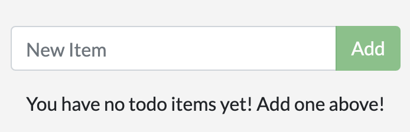  

    Add Item → Add  
<br>

5. 원하는 대로 변경을 다 하였으면, 컨테이너를 중지시키고 새 이미지를 빌드한다.  
<br>

## 멀티 컨테이너

### 컨테이너는 각 컨테이너 당 하나의 일을 하는 것이 베스트다.

- API 및 프론트엔드를 데이터베이스와 다르게 확장해야 할 가능성이 있기 때문에

- 별도의 컨테이너를 각각 격리된 버전 업데이트를 하기 위해서

- 제품 안에서 데이터베이스 관리 서비스를 사용할 수도 있다.
그러면 데이터베이스 엔진을 앱과 함께 위치시키지 않아도 괜찮다.

- 여러 프로세스를 실행하려면, 프로세스 관리자(컨테이너가 하나의 프로세스만 시작한다.)가 필요하므로 컨테이너 시작/종료 작업이 복잡해진다.

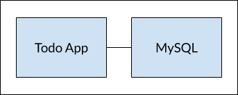  
<br>

### 컨테이너 네트워킹

> 만약 두 개의 컨테이너가 같은 네트워크 상에 위치한다면,
그들은 서로 소통할 수 있다.  
<br>

### 네트워크 연결

1. 다음 명령어를 사용하여 네트워크를 생성한다.

    ```bash
    docker network create todo-app
    ```  

2. 다음 명령어를 사용하여 MySQL 컨테이너를 실행하고, 네트워크에 연결시킨다.
데이터 베이스가 데이터 베이스를 초기화하는 데에 사용할 몇 가지 환경 변수도 정의한다.

    ```bash
    docker run -d \
        --network todo-app --network-alias mysql \
        -v todo-mysql-data:/var/lib/mysql \
        -e MYSQL_ROOT_PASSWORD=secret \
        -e MYSQL_DATABASE=todos \
        mysql:5.7
    ```

    여기서 todo-mysql-data 라는 볼륨을 사용하고 var/lib/mysql 에 마운트한다.
    그러나 볼륨 생성 명령을 실행한 적은 없지만, Docker는 우리가 네임드 도커를 사용하고 싶다는 사실을 인식하고 자동으로 생성한다.

3. 다음 명령어를 사용하여 데이터베이스와 연결이 되었는지 확인한다.

    ```bash
    docker exec -it <mysql-container-id> mysql -p
    ```

    패스워드를 입력하라고 나오는데 위에서 설정한 secret을 입력한다.

    MySQL 쉘에서 다음 명령어를 사용하여 todos 데이터베이스를 확인한다.

    ```bash
    mysql> SHOW DATABASES;
    ```

    이러한 모습이 나온다.

    ```bash
    +--------------------+
    | Database           |
    +--------------------+
    | information_schema |
    | mysql              |
    | performance_schema |
    | sys                |
    | todos              |
    +--------------------+
    5 rows in set (0.00 sec)
    ```

    데이터베이스를 사용할 준비가 되었다.  
<br>

### MySQL과 연결하기

이제 MySQL이 실행 중이라는 것을 알았으니 사용하자. 그런데 문제는 어떻게 하는지 모른다.

이를 해결하기 위해 nicolaka/netshoot 컨테이너를 사용할 예정이다.  

이 컨테이너에는 네트워킹 문제를 해결하거나 디버깅하는 데 유용한 많은 도구가 포함되어 있다.  
<br>

1. 다음 명령어를 사용하여 nicolaka/netshoot 컨테이너를 새로 생성하고 실행한다.

    ```bash
    docker run -it --network todo-app nicolaka/netshoot
    ```

2. 컨테이너 안에서 DNS 툴로서 유용한 dig 명령어를 사용한다.
호스트이름 mysql의 IP 주소 찾는다.

    ```bash
    dig mysql
    ```

    이런 식으로 나올 것이다.

    ```bash
    ; <<>> DiG 9.14.1 <<>> mysql
    ;; global options: +cmd
    ;; Got answer:
    ;; ->>HEADER<<- opcode: QUERY, status: NOERROR, id: 32162
    ;; flags: qr rd ra; QUERY: 1, ANSWER: 1, AUTHORITY: 0, ADDITIONAL: 0

    ;; QUESTION SECTION:
    ;mysql.             IN  A

    ;; ANSWER SECTION:
    mysql.          600 IN  A   172.23.0.2

    ;; Query time: 0 msec
    ;; SERVER: 127.0.0.11#53(127.0.0.11)
    ;; WHEN: Tue Oct 01 23:47:24 UTC 2019
    ;; MSG SIZE  rcvd: 44
    ```

    ANSWER SECTION 에서 172.23.0.2 로 확인되는 mysql에 대한 A가 표시된다.

    mysql 이라는 호스트에만 연결하면 데이터베이스와 소통할 수 있다.  
<br>

### MySQL과 연동하여 앱 실행하기

todo 앱은 MySQL과 연동하기 위해 몇 가지 환경 설정을 제공한다.

- MYSQL_HOST - MySQL 서버를 실행하는 호스트 이름이다.

- MYSQL_USER - 연결하는 유저의 이름이다.

- MYSQL_PASSWORD - 연결을 위한 비밀번호이다.

- MYSQL_DB - 연결을 위한 데이터베이스이다.  
<br>

1. 환경 변수를 지정하고, MySQL컨테이너를 애플리케이션 네트워크에 연결한다.

    ```bash
    docker run -dp 3000:3000 \
      -w /app -v "$(pwd):/app" \
      --network todo-app \
      -e MYSQL_HOST=mysql \
      -e MYSQL_USER=root \
      -e MYSQL_PASSWORD=secret \
      -e MYSQL_DB=todos \
      node:12-alpine \
      sh -c "yarn install && yarn run dev"
    ```  
<br>

2. 컨테이너에 대한 log (docker logs <container-id>)를 보면, mysql 데이터베이스를 사용 중임을 나타낸다.

    ```bash
    # Previous log messages omitted
    $ nodemon src/index.js
    [nodemon] 1.19.2
    [nodemon] to restart at any time, enter `rs`
    [nodemon] watching dir(s): *.*
    [nodemon] starting `node src/index.js`
    Connected to mysql db at host mysql
    Listening on port 3000
    ```  
<br>

3. todo list 에 항목을 추가한다.

4. 다음 명령어를 사용하여 mysql에 연결하고 항목이 데이터베이스에 작성되고 있음을 확인한다.

    ```bash
    docker exec -it <mysql-container-id> mysql -p todos
    ```

    mysql 쉘에서 다음 명령어를 사용한다.

    ```bash
    mysql> select * from todo_items;
    +--------------------------------------+--------------------+-----------+
    | id                                   | name               | completed |
    +--------------------------------------+--------------------+-----------+
    | c906ff08-60e6-44e6-8f49-ed56a0853e85 | Do amazing things! |         0 |
    | 2912a79e-8486-4bc3-a4c5-460793a575ab | Be awesome!        |         0 |
    +--------------------------------------+--------------------+-----------+
    ```

    todo list에 추가한 항목을 확인한다.