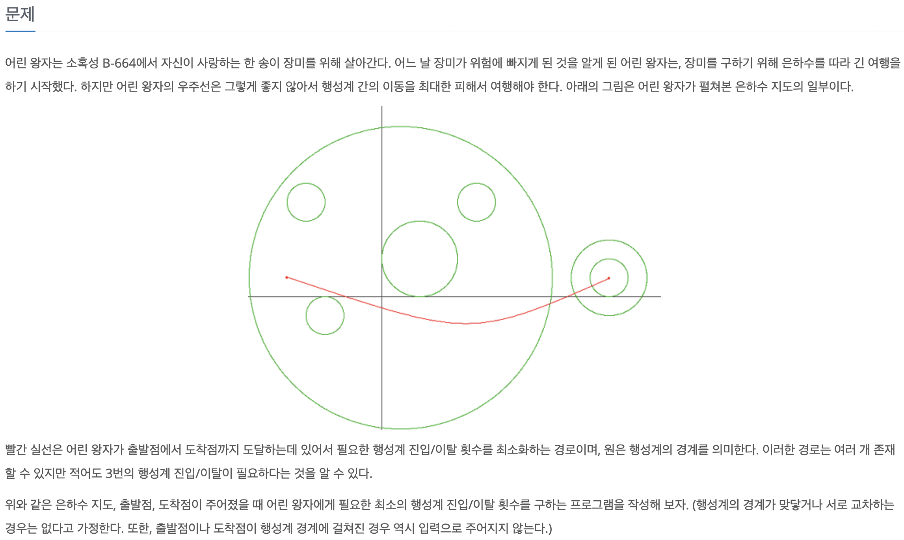
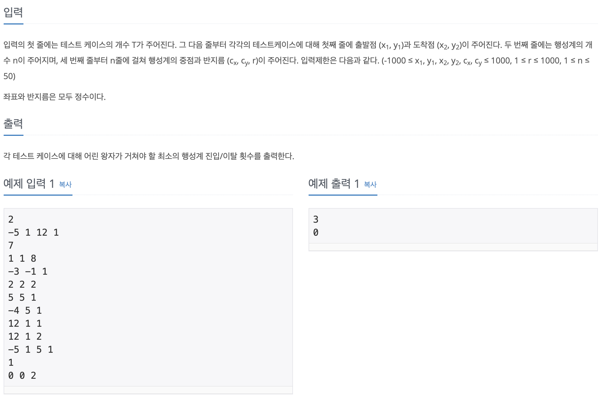

## 문제



  
<br>

## 로직  

출발점과 도착점이 몇 개의 행성계 안에 위치하느냐가 중요한 것같다.  

위의 예제에서 출발점은 두 개의 행성계 안에 위치하며 도착점은 한 개의 행성계 안에 위치한다(2 + 1 = 3).  

또한 출발점부터 도착점까지 도달하는데 있어서 필요한 행성계 진입/이탈 횟수는 3회이다.  

이러한 규칙성을 이용하여 풀면 될 것같다.  
<br>

## 코드  

```c
#include <stdio.h>
#include <math.h>

int main(void)
{
	int t, x1, y1, x2, y2, x3, y3, n, r, start, goal, result = 0;

	scanf("%d", &t);
	while (t--)
	{
		scanf("%d %d %d %d", &x1, &y1, &x2, &y2);
		scanf("%d", &n);
		while (n--)
		{
			scanf("%d %d %d", &x3, &y3, &r);
			start = sqrt(pow(x1 - x3, 2) + pow(y1 - y3, 2));
			goal = sqrt(pow(x2 - x3, 2) + pow(y2 - y3, 2));
			if (r > start && r <= goal)
				result++;
			else if (r <= start && r > goal)
				result++;
		}
		printf("%d\n", result);
		result = 0;
	}
	return (0);
}
```  
<br>

## 링크

[https://www.acmicpc.net/problem/1004](https://www.acmicpc.net/problem/1004)  