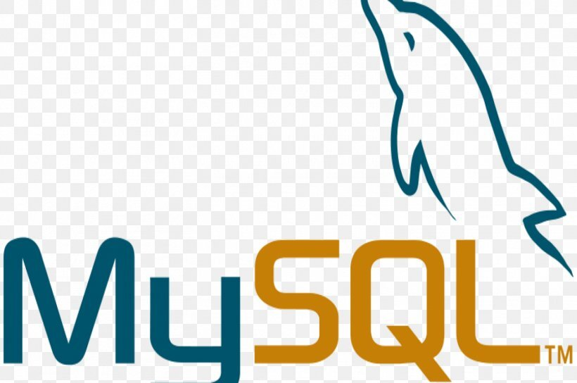
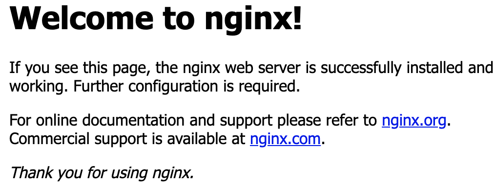

## 참고한 글

[https://yeosong1.github.io/ftserver-풀이기록](https://yeosong1.github.io/ftserver-%ED%92%80%EC%9D%B4%EA%B8%B0%EB%A1%9D)<br>
[https://dphater.tistory.com/entry/ftserver-서버-돌려보기](https://dphater.tistory.com/entry/ftserver-%EC%84%9C%EB%B2%84-%EB%8F%8C%EB%A0%A4%EB%B3%B4%EA%B8%B0)<br>
[https://velog.io/@hidaehyunlee/ftserver-총-정리-도커-설치부터-워드프레스-구축까지](https://velog.io/@hidaehyunlee/ftserver-%EC%B4%9D-%EC%A0%95%EB%A6%AC-%EB%8F%84%EC%BB%A4-%EC%84%A4%EC%B9%98%EB%B6%80%ED%84%B0-%EC%9B%8C%EB%93%9C%ED%94%84%EB%A0%88%EC%8A%A4-%EA%B5%AC%EC%B6%95%EA%B9%8C%EC%A7%80)  

---

## ft_server  
<br>

### 시스템 운영에 관한 과제  
<br>

### 소개

- 스크립트를 활용하여 업무를 자동화 시키는 것에 대한 중요성을 알게 될 것이다.

- **Doker** 라는 기술에 대해 알게 될 것이고, 도커를 사용하여 서버를 구축할 것이다.

- 서버는 **WordPress, phpMyAdmin, SQL** 등의 서비스들을 다중으로 실행시킬 수 있다.  
<br>

### 세부사항

- 서버를 구동시키기 위해 필요한 모든 파일들은 **srcs** 폴더에 위치해야 한다.

- **Dockerfile** 은 git 저장소와 같이 위치해야 한다. 이 파일은 컨테이너를 빌드할 것이다.
**docker-compose** 는 사용할 수 없다.

- WordPress 웹사이트에 필요한 모든 파일들 또한 **srcs** 에 위치해야 한다.  
<br>

### 필수사항

- Debian Buster 를 사용한다.

- 오직 하나의 도커 컨테이너 안에 Nginx 를 설치한다.

- WordPress, phpMyAdmin, MySQL 등의 모든 서비스가 연동되어야 한다.

- SQL Database 는 phpMyAdmin 과 WordPress 에서 연동하여 사용해야 한다.

- SSL 프로토콜을 사용해야 한다.

- URL redirection 을 처리해야 한다.

- 언제든지 해제할 수 있는 autoindex 가 적용되어야 한다.  
<br>

# 개념 공부

  

## Debian

- 데비안 프로젝트가 만든 자유 운영체제

- 패키지 설치 및 업그레이드가 단순

- 네트워크 결함 스토리지, 전화기, 노트북, 데스크탑, 서버 등 다양한 하드웨어에서 사용 가능하다.

- 안정성과 보안에 중점을 둔다.

- 사용자 편리성이 강한 우분투 등 다른 많은 리눅스 배포판의 기반  
<br>

  

## Nginx

- 오픈 소스 웹 서버 소프트웨어

- HTTP, 리버스 프록시, IMAP/POP3 등 서버 구동 가능

- 동시 접속 처리에 특화된 웹 서버 프로그램  
    동접자가 700명 이상이라면 서버를 증설하거나 Nginx 환경을 권장한다고 한다.

- 엔진엑스를 사용할 때 환경 설정을 바꾸고 나서 데몬을 재시작할 필요 없이 reload 시그널을 보내면 된다. 즉 프로세스를 재시작할 필요가 없다.

- 2017년 10월 기준 웹 서버 소프트웨어 순위
    1. 아파치 HTTP 서버

    2. 엔진엑스

    3. 구글 웹서버

    4. MS 인터넷 정보 서비스  
<br>

### Nginx의 역할

1. 정적 파일을 처리하는 HTTP 서버로서의 역할

    웹서버의 역할을 HTML, CSS, Javascipt, 이미지와 같은 정보를 웹 브라우저(Chrome, Internetexplore, Opera, Firefox ... 등)에 전송하는 역할을 한다.  

2. 응용 프로그램 서버에 요청을 보내는 리버스 프록시로서의 역할

    클라이언트가 가짜 서버에 요청하면, 프록시 서버가 배후 서버로 부터 데이터를 가져오는 역할을 한다. **프록시 서버=Nginx** **리버스 서버=응용프로그램서버**

    웹 응용 프로그램 서버에 리버스 프록시를 두는 이유는 요청에 대한 버퍼링이 있기 때문이다. 클라이언트가 직접 App 서버에 요청하는 경우, 프로세스 1개가 응답 대기 상태가 되어야만 한다. 따라서 프록시 서버를 둠으로써 요청을 배분하는 역할을 한다.

3. 비동기 처리 방식(Event-Drive)

    동기(Synchronous): A가 B에게 데이터를 요청했을 때, 이 요청에 따른 응답을 주어야만 A가 다시 작업 처리를 할 수 있다. (하나의 요청, 하나의 작업)

    비동기(Asynchronous): A의 요청을 B가 즉시 주지 않아도, A의 유효시간으로 또 다른 작업 처리가 가능한 방식이다.  
<br>

  

## MySQL

- 오픈 소스 DataBaseManagementSystem

    데이터베이스라는 데이터의 집합을 만들고, 저장 및 관리할 수 있는 기능들을 제공하는 응용 프로그램이다. 즉, 데이터의 관리에 특화된 프로그램이다.

    기능

    - 중복제어: 데이터의 중복 저장 현상을 방지한다.

    - 접근통제: 사용자마다 다양한 권한을 부여할 수 있다.

    - 인터페이스 제공

    - 관계표현: 서로 다른 데이터 간의 다양한 관계를 표현할 수 있는 기능을 제공한다.

    - 무결성 제약 조건: 무결성에 관한 제약 조건을 정의/검사하는 기능을 제공한다. 데이터베이스는 반드시 무결성 제약조건을 통과한 데이터만을 저장하고 있어야 한다.

    - 백업  
<br>


## PHP

- 서버 사이드에서 실행되는 서버 사이드 스크립트 언어
HTML을 프로그래밍적으로 생성해주고, 데이터베이스와 상호작용하면서 데이터를 저장하고, 표현합니다.

- C언어 기반으로 만들어졌다.

- 웹을 위해서 만들어졌으며, 웹을 위한 언어

- PHP로 작성된 코드를 HTML 코드 안에 추가하면, 웹 서버는 해당 코드를 해석하여 자동으로 HTML 문서를 생성한다.
→ 동적으로 빠르게 HTML 문서를 만들 수 있다.  
<br>

  


## phpMyAdmin

- MySQL을 WorldWideWeb에서 관리할 목적으로 PHP로 작성한 오픈 소스 도구이다.

- 데이터베이스, 테이블, 필드, 열의 작성, 수정, 삭제, SQL 상태 실행, 사용자 및 사용 권한 관리 등 다양한 작업 수행이 가능하다.
→ MySQL 관리 도구 가운데 하나이다.  
<br>

  

## Docker

- 현재 가상 머신을 대체하고 있는 가상화 플랫폼이다.

- 가상 머신에 비해 성능과 속도가 월등히 뛰어나다.

- 컨테이너 기반이다.

- 이미지라는 개념을 사용한다.  
<br>

## Image

- 컨테이너 실행에 필요한 파일과 설정 값등을 포함하고 있는 것으로 상태 값을 가지지 않고 변하지 않는다.

- 컨테이너는 이미지를 실행한 상태라고 볼 수 있고 추가되거나 변하지 않는 값은 컨테이너에 저장된다.

- 같은 이미지에서 여러 개의 컨테이너를 생성할 수 있고 컨테이너의 상태가 바뀌거나 컨테이너가 삭제되더라도 이미지는 변하지 않고 그대로 남아 있다.  
<br>

## Docker Hub

- 도커 이미지 저장소  
<br>

## Dockerfile

- 도커는 이미지를 만들기 위해 Dockerfile 이라는 파일에 자체 DSLDomain-specific language 언어를 이용하여 이미지 생성 과정을 작성한다.

- 다시 말해 Dockerfile 은 필요한 패키지를 설피하고 동작하기 위한 자신 만의 설정을 담은 파일이고, 이 파일로 이미지를 생성한다.

- 도커 명령어를 순서에 따라 빌드한다. 또한 빌드할 때 이미지가 계층적으로 쌓이며 **layer** 형태를 보인다.  
<br>

## 과제 요약

**LEMP 스택 + 워드프레스 + SSL + 오토인덱스** 옵션이 있는 도커 컨테이너를 빌드하는 자동화된 스크립트를 만들어라  


**LEMP 스택**

- 동적 웹 어플리케이션을 구현하기 위해 필요한
Linux + Nginx + MySQL(or MariaDB) + PHP(or Perl, Python) 를 모아 부르는 말

- 데비안 9부터 **MySQL은 사용하지 않고 MariaDB**를 사용한다. 데비안 버스터는 데비안 10이다.<br>
<br>

## 수행 기록  
<br>

### 1. 데비안:버스터 이미지 다운로드

```bash
docker pull debian:buster # 데비안:버스터 이미지 받기
docker images # 보유 중인 도커 이미지 확인
```  
<br>

### 2. 데비안:버스터 환경 접속

```bash
docker run -it --name jeon -p 80:80 -p 443:443 debian:buster
```

- **-i**: 입출력

- **-t**: tty 활성화

- **-name 컨테이너 이름**: 컨테이너 별칭을 사용하겠다는 명렁어

- **-p**: 80번 포트와 443번 포트를 사용하겠다는 명령어

- **debian:buster**: 마지막에 이 부분을 적지 않고 공백으로 넘긴다면 자동으로 debian:latest 인 최신 버전을 불러온다.  
<br>

### 3. apt-get 패키지관리자 업데이트 및 업그레이드

데비안:버스터는 패키지 툴인 apt를 사용한다.

```bash
apt-get update
apt-get upgrade
```  
<br>

### 4. Vim, Wget 설치

나중에 사용할 Vim과 Wget을 미리 설치한다.

```bash
apt-get install -y vim wget
```

- **-y**: yes 옵션  
<br>


### 5. Nginx 및  설치

```bash
apt-get install -y nginx
```  
<br>

### 6. Nginx 구동 및 확인

```bash
service nginx start
service nginx status
```  
<br>

### 7. [localhost](http://localhost) 접속

1. [localhost](http://localhost) 에 접속 후 nginx가 구동되는지 확인한다.

    

    이런 화면이 나온다면 성공  
<br>

2. 실패 시, 방문 기록 삭제 후 다시 시도한다. 

    또는 curl 을 사용한다.

    ```bash
    curl localhost
    ```

      
<br>

### 8. OpenSSL 설치 후 인증서 만들기

1. openssl을 설치한다.

    ```bash
    apt-get install -y openssl
    ```  
<br>

2. 인증서 만들기

    인증서 만드는 방법 두 가지

    1. Self-signed 인증서
        - CSR 명시적 생성 → 인증서에 self-sign → 인증서 완성

        - CSR을 명시적으로 생성하지 않고, key와 부가정보들을 입력하여 직접 self-sign 하여 인증서 완성  

    2. CSR (인증서 서명 요청)을 만들어 CA에 요청하여 발급  
    <br>

    아래는 Self-signed 인증서를 만드는 방법이다.

    ```bash
    openssl req -newkey rsa:4096 -days 365 -nodes -x509 \
    -subj "/C=KR/ST=Seoul/L=Seoul/O=42Seoul/OU=Lee/CN=localhost" \
    -keyout localhost.dev.key -out localhost.dev.crt # 인증서와 개인키 생성

    mv localhost.dev.crt /etc/ssl/certs/
    mv localhost.dev.key /etc/ssl/private/ # 생성된 인증서와 키를 각각 올바른 폴더로 이동시킨다.

    chmod 600 /etc/ssl/certs/localhost.dev.crt
    chmod 600 /etc/ssl/private/localhost.dev.key # 인증서와 키의 권한을 제한한다.
    ```

    - **req**: 인증서 요청 및 인증서 생성 유틸

    - **-newkey**: 개인키를 생성하기 위한 옵션

    - **rsa:4096**: 공개키 암호시스템 옵션

    - **-days 365**: 인증서의 유효기간

    - **-nodes**: 개인키를 암호화하지 않기 위한 옵션이다. 이 옵션이 없을 경우 최소 4자의 암호를 입력해야 한다.

    - **-x509**: 인증서 요청 대신 자체 서명된 인증서를 출력하는 옵션

    - **-subj "*"**: subject를 입력하기 위한 옵션이다. 해당 옵션과 뒤의 내용을 입력하지 않으면 표준 입력으로 입력해 주어야 한다.

        - **C(Country)**: 국가를 나타내는 ISO 코드

        - **ST(Street)**: 나머지 상세 주소

        - **L(City/Locality)**: 시/도

        - **O(Organization)**: 기관명

        - **OU(Organization Unit)**: 기관 내 부서명

        - **CN(Common Name)**: 인증서 고유 이름

    - **-keyout**<key_filename>: <key_filename> 이름으로 키 파일을 생성한다.

    - **-out**<crt_filename>: <crt_filename> 이름으로 인증서를 생성한다.  
<br>

### 9. Nginx SSL 설정

1. http를 https로 리다이렉션 시키기 위한 설정을 한다.

    ```bash
    vim etc/nginx/sites-available/default
    ```  
<br>

2. default 파일을 수정한다.

    ```bash
    server {
    	listen 80;
    	listen [::]:80;

        # redirection 설정
    	return 301 https://$host$request_uri;
    }

    server {
    	listen 443 ssl;
    	listen [::]:443 ssl;

    	# ssl 설정
    	ssl on;
    	ssl_certificate /etc/ssl/certs/localhost.dev.crt;
    	ssl_certificate_key /etc/ssl/private/localhost.dev.key;

    	# root 디렉토리 설정
    	root /var/www/html;

    	# 읽을 파일 목록
    	index index.html index.htm index.nginx-debian.html;

    	server_name ft_server;

    	# /를 기준으로 request_uri에 해당하는 디렉토리 찾음.
    	# 기준은 location의 "/"로 지정
    	location / {
    	# try_files로 $uri에 해당하는 파일과 디렉토리를 찾는다.
    	# 파일을 먼저 찾으며 파일과 디렉토리가 없다면 404 에러를 띄운다.
    	# 디렉토리는 있고 위에 있는 index로 정한 파일이 없을 경우 403 에러를 띄운다.
    		try_files $uri $uri/ = 404;
    	}
    }
    ```  
<br>

### 10. 수정 적용 후 [localhost](http://localhost) 접속

1. 수정 적용을 위해 nginx를 reload 한다.

    ```bash
    service nginx reload
    ```  
<br>

2. localhost에 접속한다.

      

    이런 화면이 나올 경우 NET:ERR_CERT_INVALID를 클릭 후 "thisisunsafe" 타이핑하면 들어가진다.  
    <br>

        

    크롬 환경에서 주의 요함을 클릭하여 위의 창이 나온다면 성공  
<br>

### 11. php-fpm 설치 후 default 파일 다시 수정

1. 동적 페이지를 사용할 수 있도록 도와주는 php-fpm을 다운 받는다.
nginx는 동적 페이지를 사용할 수 없다.
php-fpm은 nginx와 php를 연동시켜준다.

    ```bash
    apt-get install -y php-fpm
    ```  
<br>

2. default 파일 수정

    ```bash
    server {
    	listen 80;
    	listen [::]:80;

    	return 301 https://$host$request_uri;
    }

    server {
    	listen 443 ssl;
    	listen [::]:443 ssl;

    	ssl on;
    	ssl_certificate /etc/ssl/certs/localhost.dev.crt;
    	ssl_certificate_key /etc/ssl/private/localhost.dev.key;

    	root /var/www/html;

    	# index.php 추가
    	index index.php index.html index.htm; index.nginx-debian.html;

    	server_name ft_server;

    	location / {
    		try_files $uri $uri/ = 404;
    	}

    	# php 추가
    	location ~ \.php$ {
    		include snippets/fastcgi-php.conf;
    		fastcgi_pass unix:/var/run/php/php7.3-fpm.sock;
    	}
    }
    ```  
<br>

### 12. php-fpm 실행 및 확인

1. php7.3-fpm을 실행

    ```bash
    service php7.3-fpm start
    service php7.3-fpm status
    ```  
<br>

2. /var/www/html/ 위치에 phpinfo.php 파일을 만든 후 아래 코드를 입력한다.

    ```bash
    <?php phpinfo(); ?>
    ```  
<br>

3. nginx reload

    ```bash
    service nginx reload
    ```  
<br>

4. [localhost/phpinfo.php](http://localhost/phpinfo.php) 로 접속한다.

    phpinfo.php는 테스트 후 삭제하는 것이 보안에 좋다고 한다.

      
<br>

### 13. autoindex 설정

- URL로 접근한 디렉토리에 index 목록에 해당하는 파일이 없다면 리스트 형태로 디렉토리와 파일을 보여주는 옵션이다.

- default 파일의 location / 부분에 autoindex on; 만 작성하면 활성화된다.  
<br>

1. 주석 추가하기

    ```bash
    server {
    	listen 80;
    	listen [::]:80;

    	return 301 https://$host$request_uri;
    }

    server {
    	listen 443 ssl;
    	listen [::]:443 ssl;

    	ssl on;
    	ssl_certificate /etc/ssl/certs/localhost.dev.crt;
    	ssl_certificate_key /etc/ssl/private/localhost.dev.key;

    	root /var/www/html;

    	# 주석 추가
    	index index.php index.html index.htm; # index.nginx-debian.html;

    	server_name ft_server;

    	# autoindex on 추가
    	location / {
    		autoindex on;
    		try_files $uri $uri/ = 404;
    	}

    	location ~ \.php$ {
    		include snippets/fastcgi-php.conf;
    		fastcgi_pass unix:/var/run/php/php7.3-fpm.sock;
    	}
    }
    ```  
<br>

2. nginx reload

    ```bash
    service nginx reload
    ```  
<br>

3. [localhost](http://localhost) 접속

      
<br>

### 14. MariaDB(MySQL), php-mysql, php-mbstring설치

MariaD

- 과제에서 MySQL을 사용하라고 명시하였지만, 데비안:버스터에서는 MySQL을 지원하지 않고 MariaDB를 지원한다.

- 그러나 MariaDB는 MySQL을 베이스로 만들어졌으며 모든 명령이 동일하여 대신 사용할 수 있다.  
<br>

php-mysql

- php에서 mysql에 접근할 수 있도록 하는 모듈이다.

- 즉 Wordpress나 phpMyAdmin에서 database에 접근하기 위해 필요하다.  
<br>

php-mbstring

- 2바이트 확장 문자를 읽을 수 있도록 하는 확장이다.

- 없다면 이후 phpmyadmin 페이지에서 경고 메시지가 나온다.  
<br>

```bash
apt-get install -y mariadb-server php-mysql php-mbstring
```  
<br>

### 15. Wordpress 설치 및 설정

1. Wordpress와 phpMyAdmin은 apt-get으로 설치할 수 없다. 그래서 아까 받은 Wget을 사용한다.

    ```bash
    wget https://wordpress.org/latest.tar.gz

    tar -xvf latest.tar.gz # 압축 해제

    rm latest.tar.gz # 압축파일 삭제

    mv wordpress/ var/www/html/ # 이름 변경

    chown -R www-data:www-data /var/www/html/wordpress # 폴더 이동
    ```

    - **chown**: 리눅스에서 소유자를 변경하는 커맨드
    - **-R**: -recursive. 에러 메시지가 있어도 출력하지 않게 한다.
    - **www-data**: 우분투에서 Apache.PHP 실행 시 수정이 가능한 권한  
<br>

2. var/www/html/wordpress/wp-config.php에 설정 수정

    ```bash
    cp var/www/html/wordpress/wp-config-sample.php var/www/html/wordpress/wp-config.php 
    vim var/www/html/wordpress/wp-config.php 

    아래 세 부분을 내용에 맞게 바꿔준다. 

    // ** MySQL settings - You can get this info from your web host ** //
    /** The name of the database for WordPress */
    define( 'DB_NAME', 'wordpress' );

    /** MySQL database username */
    define( 'DB_USER', 'jeunjeon' );

    /** MySQL database password */
    define( 'DB_PASSWORD', 'jeunjeon' );
    ```  
<br>

### 16. wordpress DB 테이블 생성

1. database에 wordpress를 추가하기 위해 mysql 실행

    ```bash
    service mysql start
    mysql # mysql로 들어가기
    ```  
<br>

2. database 설정

    ```bash
    CREATE DATABASE wordpress; # wordpress 데이터베이스 생성하기
    SHOW DATABASES; # 데이터베이스 목록 보기
    ```  
<br>

3. 유저 생성하기

    ```bash
    CREATE USER 'jeunjeon'@'localhost' IDENTIFIED BY 'jeunjeon';
    # jeunjeon이라는 아이디와 jeunjeon이라는 비밀번호 생성

    GRANT ALL PRIVILEGES ON wordpress.* TO 'jeunjeon'@'localhost' WITH GRANT OPTION;
    # 권한부여
    ```  

    @'localhost'는 로컬 접속만 허용하겠다는 것이다.  
<br>

4. table 확인하기

    ```bash
    USE wordpress; # 데이터 베이스 선택하기
    SHOW TABLES; # 테이블 확인하기
    ```

    테이블을 확인해보면 비어있다.  
<br>

5. mysql 빠져나가기

    ```bash
    exit
    ```  
<br>

6. nginx, php7.3-fpm reload

    ```bash
    service nginx reload
    service php7.3-fpm reload
    ```  
<br>

7. [localhost/wordpress](http://localhost/wordpress) 접속

      
<br>

### 17. phpMyAdmin 설치 및 설정

1. Wget을 사용한다.

    ```bash
    wget https://files.phpmyadmin.net/phpMyAdmin/5.0.2/phpMyAdmin-5.0.2-all-languages.tar.gz

    tar -xvf phpMyAdmin-5.0.2-all-languages.tar.gz # 압축해제

    rm phpMyAdmin-5.0.2-all-languages.tar.gz # 압축파일 삭제

    mv phpMyAdmin-5.0.2-all-languages phpmyadmin # 이름 변경

    mv phpmyadmin /var/www/html/ # 폴더 이동
    ```  
<br>

2. phpmyadmin/config.sample.inc.php 파일의 이름을 config.inc.php로 수정한다.

    ```bash
    mv var/www/html/phpmyadmin/config.sample.inc.php var/www/html/phpmyadmin/config.inc.php
    ```  
<br>

3. 블로피시 암호를 생성한다.

    [블로피시 암호 생성 사이트](https://phpsolved.com/phpmyadmin-blowfish-secret-generator/?g=%5Binsert_php%5Decho%20$code;%5B/insert_php%5D)  
<br>

4. 블로피시 암호를 복사해서 붙여넣는다.

    ```bash
    $cfg['blowfish_secret'] = '여기에 붙여넣기'; /* YOU MUST FILL IN THIS FOR COOKIE AUTH! */
    ```  
<br>

5. database 설정

    /var/www/html/phpmyadmin/sql 디렉토리의 create_tables.sql 파일을 mysql로 리디렉션한다.

    ```bash
    mysql < /var/www/html/phpmyadmin/sql/create_tables.sql
    ```  
<br>

6. [localhost/phpmyadmin](http://localhost/phpmyadmin) 접속

      
<br>


여기까지가 도커를 이용해 웹서버를 설치하는 과정이다.  

위의 과정을 Dockerfile과 srcs에 잘 넣어 자동화 하게 하면 된다.